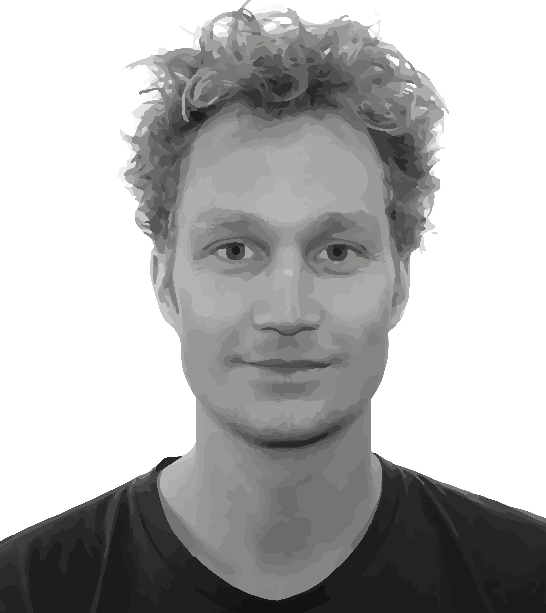

### Contact

Insect-Virus Interactions Unit  
Department of Virology  
Institut Pasteur  
28 rue du Dr. Roux  
Paris, France  

_______

Center for Research and Interdisciplinarity  
8bis rue Charles V  
Paris, France  

### Academic Bio

I received my PhD in Biophysics from Delft University of Technology (the Netherlands) using microfabrication to study spatial aspects of bacterial cooperation, colonization, and competition working with [Cees Dekker](https://ceesdekkerlab.nl/) and [Juan Keymer](http://keymerlab.nl/www/). After defending my PhD, I did a short postdoc  joint between the labs of [George Whitesides](https://gmwgroup.harvard.edu/) (Harvard University) and Cees Dekker (Delft). Subsequently, I changed my focus from bacteria to mosquitoes and moved to Stanford University to work with [Manu Prakash](http://web.stanford.edu/group/prakash-lab/cgi-bin/labsite/) on several problems related to mosquito ecology and viral evolution, first as a Rubicon fellow and later as a [BWF CASI](https://www.bwfund.org/grant-programs/interfaces-science/career-awards-scientific-interface) fellow. Currently, I am a Marie Curie fellow at the [Insect-Virus Interactions Unit](https://research.pasteur.fr/en/team/insect-virus-interactions/) at Institut Pasteur working with [Louis Lambrechts](https://research.pasteur.fr/en/member/louis-lambrechts/), and starting as a long-term fellow at the Center for Research and Interdisciplinarity ([CRI-paris](https://cri-paris.org/)). He develops new technologies to study mosquito biology and leverages these tools to understand the internal and external drivers of mosquito behaviors that are relevant to pathogen transmission.

{:style="width: 400px; float: right; margin-right: 0px; margin-top: 6px; margin-left: 0px, margin-bottom: 0px"}

<!-- Type on Strap is based on Type Theme, a free and open-source theme for [Jekyll](http://jekyllrb.com/), licensed under the MIT License.

Head over to the [theme's documentation](https://github.io/sylhare/Type-on-Strap) for much more information about Type on Strap or to install this theme on your own Jekyll site.

This file is an example of a page in Jekyll, that automatically shows up in the header navigation, you can delete or modify this file freely. -->
 
