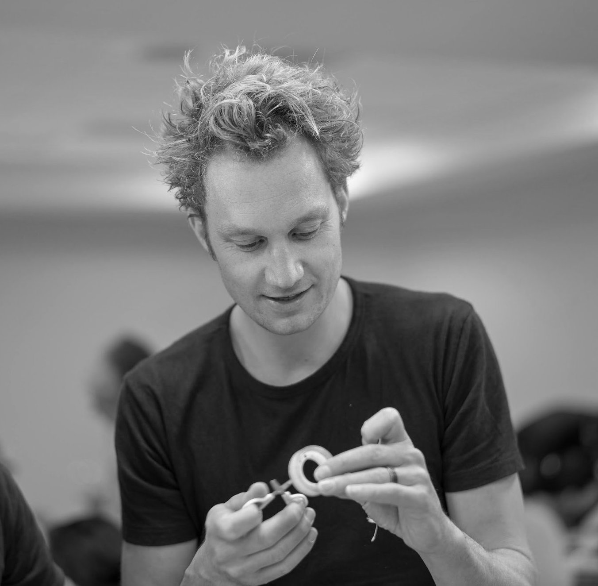

### Contact

Vector Biology  
Dept. of Medical Microbiology  
Radboud Institute for Molecular Life Sciences  
Radboud University Medical Center  
Geert Grooteplein 28  
6525 GA Nijmegen  
The Netherlands  

_______

### Academic Bio

After a MSc. in 'Physics of life' at VU Amsterdam, I received a PhD in Biophysics from Delft University of Technology (the Netherlands) using microfabrication to study spatial aspects of bacterial cooperation, colonization, and competition working with [Cees Dekker](https://ceesdekkerlab.nl/) and [Juan Keymer](http://keymerlab.nl/www/). After defending my PhD, I did a short postdoc joint between the labs of [George Whitesides](https://gmwgroup.harvard.edu/) (Harvard University) and Cees Dekker (Delft). Next, I changed my focus from bacteria to mosquitoes and moved to Stanford University to work with [Manu Prakash](http://web.stanford.edu/group/prakash-lab/cgi-bin/labsite/) on several problems related to mosquito ecology and viral evolution, first as a Rubicon fellow and later as a [BWF CASI](https://www.bwfund.org/grant-programs/interfaces-science/career-awards-scientific-interface) fellow. In 2019, I moved to Paris as a Marie Curie fellow at the [Insect-Virus Interactions Unit](https://research.pasteur.fr/en/team/insect-virus-interactions/) at Institut Pasteur collaborating with [Louis Lambrechts](https://research.pasteur.fr/en/member/louis-lambrechts/), and a long-term fellow leading a research team at the Center for Research and Interdisciplinarity ([Bites, Blood, and Behavior team at CRI-paris](https://projects.cri-paris.org/projects/pZDJguA1/summary)). After being recruited by the CNRS I became a permanent researcher at Institut Pasteur. Supported by a Hypatia fellowship and an NWO Vidi grant I joined the [Radboud University Medical Center](https://www.radboudumc.nl/en/radboud-institute-for-molecular-life-sciences) in the fall of 2022 to set up a vector biology research group. At RUMC we will develop new technologies to study mosquito biology and leverage these tools to understand the internal and external drivers of mosquito behaviors that are relevant to pathogen transmission.

{:style="width: 400px; float: right; margin-right: 0px; margin-top: 6px; margin-left: 0px, margin-bottom: 0px"}

<!-- Type on Strap is based on Type Theme, a free and open-source theme for [Jekyll](http://jekyllrb.com/), licensed under the MIT License.

Head over to the [theme's documentation](https://github.io/sylhare/Type-on-Strap) for much more information about Type on Strap or to install this theme on your own Jekyll site.

This file is an example of a page in Jekyll, that automatically shows up in the header navigation, you can delete or modify this file freely. -->
